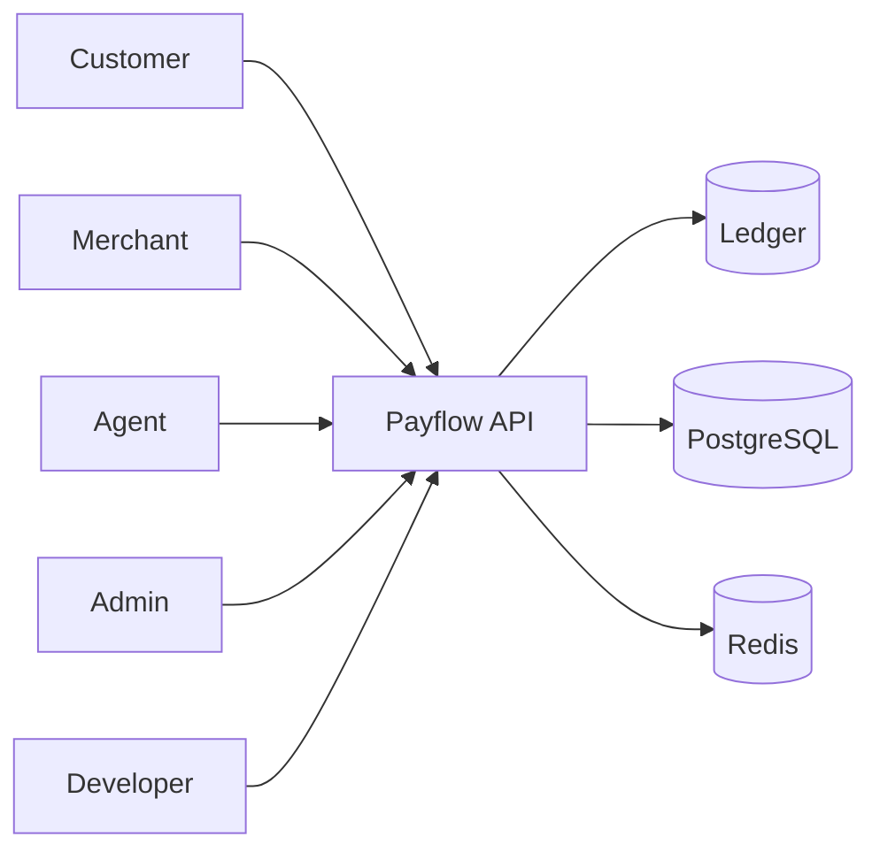
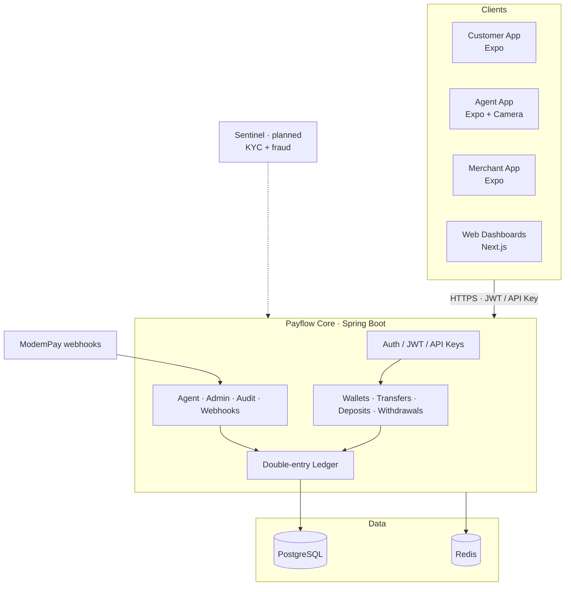
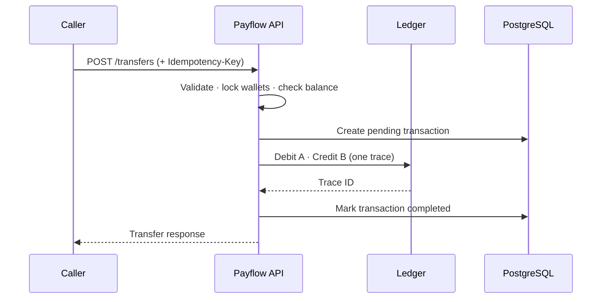
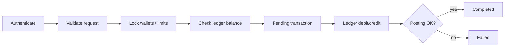
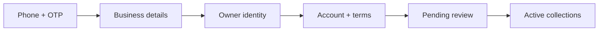
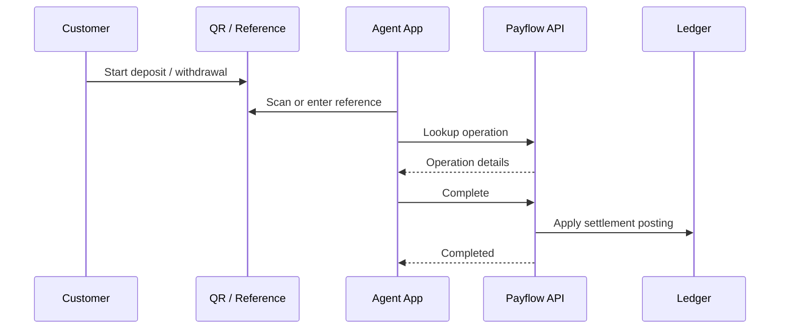

<div align="center">


<br />


<br />


</div>

---

Payflow is a digital payments platform built around a double-entry ledger. It supports customer wallets, merchant collections, agent-assisted cash deposit and withdrawal, admin operations, and developer integrations.

The balance a user sees in an app is not a field that gets incremented and decremented in isolation. Every wallet is linked to a ledger account. Every movement of money is recorded as balanced debit and credit postings under a unique trace. The displayed balance is computed from those postings.

Identity verification (KYC) and fraud detection will be handled by a separate system called **Sentinel**. That integration is planned and is not part of this repository yet.

<div align="center">

</div>

## Table of contents

1. [Background](#background)
2. [What Payflow covers](#what-payflow-covers)
3. [Roles and products](#roles-and-products)
4. [High-level architecture](#high-level-architecture)
5. [The ledger](#the-ledger)
6. [Core money flows](#core-money-flows)
7. [Merchants and payment links](#merchants-and-payment-links)
8. [Agents and cash operations](#agents-and-cash-operations)
9. [Authentication and authorization](#authentication-and-authorization)
10. [Security and operational controls](#security-and-operational-controls)
11. [Data stores and infrastructure](#data-stores-and-infrastructure)
12. [KYC and fraud — Sentinel](#kyc-and-fraud--sentinel)
13. [Repository layout](#repository-layout)
14. [API surface](#api-surface)
15. [Clients](#clients)
16. [Quick start](#quick-start)
17. [Configuration notes](#configuration-notes)
18. [Documentation](#documentation)
19. [Current status](#current-status)
20. [License](#license)

---

## Background

Many wallet products store a single number per account and update it on every transfer. That approach is easy to ship and hard to trust once you deal with:

- network retries that hit the same endpoint twice
- partial failures mid-transaction
- admin corrections and reversals
- questions like “where did this money come from?”
- differences between what the app shows and what the books should show

Payflow is built so the **ledger is the source of truth**. Application transactions (deposits, withdrawals, transfers) reference ledger traces. Reconciliation jobs compare wallet/transaction history against ledger balances and record mismatches when they diverge.

The product also has to match how money moves outside pure app-to-app transfers. People still cash in and cash out through agents. Merchants need collection tools. Admins need freeze, reverse, and audit capabilities. Developers need stable APIs and API keys.

---

## What Payflow covers

| Area | Capability |
|---|---|
| **Wallets** | Create wallets, view balances, enforce status and limits |
| **Transfers** | Move value between wallets with ledger postings and idempotency keys |
| **Deposits** | Start deposit flows (including agent / provider paths) |
| **Withdrawals** | Start payout / cash-out flows |
| **Payment links** | Merchants create shareable collection links |
| **Merchant onboarding** | Multi-step registration (phone, business, owner, account) |
| **Agent operations** | Look up and complete deposit/withdrawal references via QR |
| **Admin** | Freeze/unfreeze, reverse, reconcile, audit trail, dashboards |
| **Auth** | Register/login, JWT access + refresh tokens, API keys |
| **Webhooks** | ModemPay settlement callbacks with signature verification |
| **Notifications** | Pluggable SMS / email for 2FA and alerts |
| **Reconciliation** | Wallet vs ledger consistency checks |

---

## Roles and products

Payflow is multi-sided. Each role gets a different surface, but they all talk to the same core API and the same ledger.

| Role | Product | Typical actions |
|---|---|---|
| **Customer (`USER`)** | Customer mobile app + customer web views | Send money, deposit, withdraw, view history |
| **Merchant (`MERCHANT`)** | Merchant mobile app + merchant web dashboard | Register, hold a collections wallet, create payment links |
| **Agent (`AGENT`)** | Agent mobile app | Scan customer QR, look up operation, mark completed |
| **Admin (`ADMIN`)** | Admin web / ops views | Freeze wallets, reverse transactions, run reconciliation, review audit logs |
| **Developer (`DEVELOPER`)** | Developer portal | Create and revoke API keys, integrate collections and payouts |



Role checks are enforced in the API. For example, agent operation endpoints require `AGENT` or `ADMIN`. Wallet credit/debit minting endpoints are admin-only. Client apps also reject the wrong role at login so a merchant account cannot casually use the agent app.

---

## High-level architecture



The core API is the only place money is posted to the ledger. Mobile and web clients never write balances locally as truth — they call the API and render responses.

---

## The ledger

### Why a ledger instead of a balance column

A balance column answers “how much do we think this user has right now?”  
A ledger answers “what events produced that number, and can we prove the books still balance?”

In Payflow:

1. Creating a wallet also creates a linked **ledger account**.
2. Wallet ledger accounts are **liabilities**. The platform owes that amount to the wallet owner.
3. Platform cash is tracked in **asset** accounts (for example `PLATFORM:CASH:GMD`).
4. Every financial movement creates one or more **postings** (debit or credit lines).
5. Those postings share a **trace ID**. The same trace cannot be posted twice.
6. Balance for an account is **computed** from the sum of its postings (credits minus debits for liabilities; debits minus credits for assets).

### Account types and normal balances

| Type | Example | Balance meaning |
|---|---|---|
| **LIABILITY** | User / merchant wallet | What Payflow owes the holder |
| **ASSET** | Platform cash clearing | Cash / claims held by the platform |

### Posting examples

<details>
<summary><b>Deposit of 1,000 GMD into a wallet</b></summary>

```text
DEBIT   PLATFORM:CASH:GMD          1,000   (platform cash increases)
CREDIT  WALLET:{id}:LIABILITY      1,000   (platform owes user more)
```

</details>

<details>
<summary><b>Withdrawal of 400 GMD from a wallet</b></summary>

```text
DEBIT   WALLET:{id}:LIABILITY        400   (liability shrinks)
CREDIT  PLATFORM:CASH:GMD            400   (cash leaves platform clearing)
```

</details>

<details>
<summary><b>Transfer of 500 GMD from wallet A to wallet B</b></summary>

```text
DEBIT   WALLET:A:LIABILITY           500
CREDIT  WALLET:B:LIABILITY           500
Net change across the books:           0
```



</details>

### Rules enforced when posting

| Rule | What it means |
|---|---|
| **Zero-sum** | Total debits must equal total credits, or the posting is rejected |
| **Unique traces** | If a trace ID already exists, the posting is rejected |
| **Currency match** | Posting currency must match the ledger account currency |
| **Active accounts** | Inactive accounts cannot receive postings |
| **Funds check** | Reductions check the computed ledger balance (and wallet limits) |

### Reconciliation

Reconciliation jobs compare:

- balances derived from the ledger, and
- balances implied by recorded wallet / transaction history

When they disagree, Payflow stores a **mismatch** against a reconciliation report. That is intentional: drift should be visible to ops, not silently “fixed” by overwriting a number.

### Transactions vs ledger

Payflow keeps both:

- **Transaction records** — product-level history (type, status, reference, parties, amounts)
- **Ledger postings** — accounting-level truth tied by trace / reference

A transfer typically creates a pending transaction, posts the ledger entries, then marks the transaction completed with the ledger trace ID. Failures mark the transaction failed rather than leaving an unexplained balance change.

---

## Core money flows

### Transfer (wallet to wallet)



1. Caller authenticates.
2. Request is validated (amount, wallets, ownership of source wallet).
3. Wallets are locked / checked for status and limits.
4. Source ledger balance must cover the amount.
5. A pending transfer transaction is created.
6. Ledger posts debit(source) / credit(destination) under one trace.
7. Transaction is marked completed (or failed if posting fails).
8. Daily / limit usage is updated as configured.

Clients may send an **Idempotency-Key** (or stable reference) so retries do not create a second successful transfer.

### Deposit

Deposits can follow different rails depending on method (for example provider checkout or agent cash-in):

1. User (or merchant) creates a deposit request against a wallet.
2. A deposit record is stored with a reference and status (for example awaiting agent or awaiting provider).
3. When settlement is confirmed — agent completion and/or ModemPay webhook — the ledger credit is applied.
4. Status moves to completed; history becomes visible on the wallet.

### Withdrawal

1. User creates a withdrawal against a wallet.
2. Funds availability and limits are checked.
3. Withdrawal is tracked through its lifecycle (awaiting agent / provider, then completed).
4. On completion, the ledger debits the wallet liability and credits platform cash clearing as appropriate.

Exact provider steps depend on ModemPay configuration and webhook handling. Signature verification is used so forged callbacks cannot credit or debit wallets.

---

## Merchants and payment links

Merchants register through a staged flow:



1. Phone capture and OTP verification  
2. Business details (name, category, region, address, registration number)  
3. Owner identity details  
4. Account credentials and terms acceptance  

After registration, a merchant may sit in **pending review** until an admin / ops process activates them for full collections.

Once active, merchants can:

- hold a collections wallet
- create **payment links** (amount, currency, description, expiry)
- track incoming activity from dashboards

Payment links are meant for sharing a checkout / pay request without building a custom integration for every sale. Developers can also drive collections programmatically via API keys.

---

## Agents and cash operations

Not every deposit or withdrawal is purely digital. Agents handle physical cash against a digital reference.



1. Customer starts a deposit or withdrawal in their app and receives a **reference** (often shown as QR).
2. Agent opens the agent app, scans the QR or enters the reference.
3. Agent API looks up the operation (`/api/v1/agent/operations/{reference}`).
4. Agent confirms cash exchanged hands and calls complete.
5. Backend updates operation status and applies the corresponding ledger movement when the business rules say settlement is done.

Agent endpoints are restricted to `AGENT` (and `ADMIN`). The agent app refuses login for non-agent roles.

---

## Authentication and authorization

### End-user / staff sessions

- Login and register under `/api/auth`
- Short-lived **access tokens** (JWT)
- Longer-lived **refresh tokens** for silent renewal
- Clients refresh on `401` and clear session if refresh fails

### API keys (developers / integrations)

- Create, list, revoke, delete keys under `/api/auth/api-keys`
- Keys are scoped to the owning developer account
- Used as `X-Api-Key` for server-to-server calls

### Roles

Spring Security roles gate modules:

| Capability | Roles |
|---|---|
| Normal wallet operations | Authenticated wallet owners |
| Agent lookup / complete | `AGENT`, `ADMIN` |
| Wallet credit / debit minting | `ADMIN` |
| Admin dashboards / reconciliation | `ADMIN` |

Ownership checks still apply inside services: having a valid token is not enough to operate on someone else’s wallet.

---

## Security and operational controls

| Control | Behavior |
|---|---|
| Role boundaries | Separate powers for users, merchants, agents, admins, developers |
| Admin-only minting | Direct credit/debit that could inflate balances is not a public wallet action |
| Rate limiting | Redis-backed limits on login / register / refresh by client IP |
| Trusted proxies | `X-Forwarded-For` / `X-Real-IP` only trusted from private network ranges |
| JWT hardening | Production rejects missing/short/default secrets |
| Session storage | Mobile apps use SecureStore; web uses browser storage for API sessions |
| HTTPS in prod clients | Production builds require HTTPS API base URLs |
| Webhook authenticity | ModemPay callbacks verified with signing secret |
| Audit trail | Sensitive admin actions recorded for later review |
| Risk flags | Internal flags for operational review (not a substitute for Sentinel) |
| Error responses | Clients get safe messages; stack traces are not leaked in production |

Production profile defaults include Swagger disabled and JPA `ddl-auto=validate` so the app does not silently rewrite schema.

---

## Data stores and infrastructure

| Store | Use |
|---|---|
| **PostgreSQL** | Users, wallets, ledger accounts/postings, transactions, deposits, withdrawals, payment links, audit, reconciliation |
| **Redis** | Distributed rate limiting and caching needs |

Docker Compose production stack runs Postgres, Redis, and the Payflow API together. See `server/docker-compose.prod.yml` and `server/DEPLOYMENT.md`.

Health is exposed via Spring Actuator (health endpoint for orchestration).

---

## KYC and fraud — Sentinel

Payflow currently includes wallet limits, risk flags, and admin controls. Full **KYC** and **fraud decisioning** are intentionally deferred.

**Sentinel** is the planned service for:

- identity / KYC verification during onboarding and limit upgrades
- fraud detection and allow / review / block decisions on money movement

When Sentinel is ready, Payflow will call into it at the appropriate points in registration and payment flows. Until then, do not treat this repository as a complete compliance or fraud stack.

---

## Repository layout

```text
payflow-server/
├── server/
│   ├── payflow/                  # Spring Boot application
│   │   └── src/main/java/com/mamadou/payflow/
│   │       ├── auth/             # Login, JWT, API keys
│   │       ├── wallet/           # Wallets, limits, balances
│   │       ├── ledger/           # Accounts, postings, balance computation
│   │       ├── transfer/         # P2P / wallet transfers
│   │       ├── deposit/          # Deposits
│   │       ├── withdrawal/       # Withdrawals
│   │       ├── paymentlink/      # Merchant payment links
│   │       ├── subscription/     # Subscriptions
│   │       ├── merchant/         # Merchant registration
│   │       ├── agent/            # Agent lookup / complete
│   │       ├── admin/            # Ops controls
│   │       ├── reconciliation/   # Wallet vs ledger checks
│   │       ├── webhook/          # ModemPay callbacks
│   │       ├── risk/             # Risk flags / rules hooks
│   │       ├── audit/            # Audit logging
│   │       ├── notification/     # SMS / email abstraction
│   │       └── transaction/      # Transaction records
│   ├── docker-compose.yml
│   ├── docker-compose.prod.yml
│   ├── DEPLOYMENT.md
│   └── README.md                 # Detailed server docs
├── ui/
│   ├── payflow-app/              # Customer Expo app
│   ├── payflow-agent/            # Agent Expo app
│   ├── merchant-app/             # Merchant Expo app
│   └── web/                      # Next.js site + dashboards
└── README.md                     # This file
```

---

## API surface

Base URL (local): `http://localhost:5000`

| Area | Prefix | Notes |
|---|---|---|
| Auth | `/api/auth` | Register, login, refresh, logout, API keys |
| Merchant registration | `/api/auth/merchant/register` | Staged onboarding |
| Wallets | `/api/v1/wallets` | List/create, balance; admin credit/debit |
| Transfers | `/api/v1/transfers` | Wallet-to-wallet |
| Deposits | `/api/v1/deposits` | Create / track deposits |
| Withdrawals | `/api/v1/withdrawals` | Create / track withdrawals |
| Payment links | `/api/v1/payment-links` | Merchant collections |
| Subscriptions | `/api/v1/subscriptions` | Recurring plans |
| Transactions | `/api/v1/transactions` | History and lookup |
| Agent ops | `/api/v1/agent/operations` | Lookup + complete by reference |
| Admin | `/api/v1/admin` | Dashboard, freeze, reverse, audit |
| Reconciliation | `/api/v1/reconciliation` | Admin-triggered checks |
| Webhooks | `/api/v1/webhooks` | Provider callbacks |
| Risk | `/api/v1/risk` | Flags and summaries |

For request/response shapes and deeper endpoint notes, see [`server/README.md`](server/README.md).

---

## Clients

| App | Path | Purpose |
|---|---|---|
| Customer | `ui/payflow-app` | Balances, send, deposit, withdraw, activity |
| Agent | `ui/payflow-agent` | QR scan and cash operation completion |
| Merchant | `ui/merchant-app` | Registration and collections home |
| Web | `ui/web` | Landing + admin / merchant / developer / customer dashboards |

**Customer app** — Expo wallet client with JWT + refresh. Production builds require `EXPO_PUBLIC_API_BASE_URL` over HTTPS.

**Agent app** — Expo + camera. Login limited to agent (or admin) accounts.

**Merchant app** — Expo registration and collections overview. Login expects a merchant role.

**Web** — Next.js marketing and dashboards. Demo auth is env-gated and should stay off in production.

---

## Quick start

### Prerequisites

- Docker and Docker Compose (recommended), **or**
  - JDK 17+
  - Maven
  - PostgreSQL 16
  - Redis 7
- Node 20+ for web and mobile

### 1. Start the core API

```bash
cd server
cp .env.example .env
# Fill in Postgres, Redis, JWT, and ModemPay values

docker compose -f docker-compose.prod.yml up -d --build
```

API listens on `http://localhost:5000`.

**Schema bootstrap:** on a fresh database you may need `SPRING_JPA_DDL_AUTO=update` once to create tables, then switch back to `validate`. Dedicated migrations (Flyway / Liquibase) are planned.

### 2. Start the web app

```bash
cd ui/web
cp .env.example .env.local
# NEXT_PUBLIC_API_BASE_URL=http://localhost:5000

npm install
npm run dev
```

### 3. Start a mobile app

```bash
cd ui/payflow-app   # or ui/payflow-agent / ui/merchant-app
cp .env.example .env
# EXPO_PUBLIC_API_BASE_URL=http://localhost:5000

npm install
npx expo start
```

Point the device or emulator at a reachable API host (not only `localhost` from a physical phone).

---

## Configuration notes

Common variables (see `server/.env.example` and `server/DEPLOYMENT.md` for the full list):

| Variable | Purpose |
|---|---|
| `POSTGRES_*` / datasource URL | Database connection |
| `REDIS_HOST` / `REDIS_PASSWORD` | Redis for rate limiting |
| `JWT_SECRET` | Signing key for access tokens (long, random, required in prod) |
| `MODEMPAY_*` | Provider API key and webhook signing secret |
| `SPRING_PROFILES_ACTIVE` | Use `prod` for production settings |
| `SPRING_JPA_DDL_AUTO` | Prefer `validate` after schema exists |

Client apps:

| Variable | Purpose |
|---|---|
| `EXPO_PUBLIC_API_BASE_URL` | Mobile API base (HTTPS required in production builds) |
| `NEXT_PUBLIC_API_BASE_URL` | Web API base (HTTPS required in production) |
| `NEXT_PUBLIC_ENABLE_DEMO_AUTH` | Must remain unset/false in production |

---

## Documentation

| Document | Contents |
|---|---|
| [`server/README.md`](server/README.md) | Server modules, endpoints, concurrency, ModemPay detail |
| [`server/DEPLOYMENT.md`](server/DEPLOYMENT.md) | Production Docker and environment setup |
| [`ui/README.md`](ui/README.md) | How to run each frontend |

---

## Current status

### In place today

- Double-entry ledger with computed balances and reconciliation
- Transfers, deposits, withdrawals, payment links
- Merchant registration and agent cash completion flows
- JWT + refresh, API keys, role-scoped endpoints
- Admin freeze / reverse / audit paths
- Customer, agent, merchant, and web clients against the same API
- Docker-based deployment layout

### Still ahead

- Formal database migrations (Flyway / Liquibase)
- Live SMS / email providers in production
- Production payment-rail credentials and operational runbooks
- App store / EAS release configuration finalized per environment
- **Sentinel** integration for KYC and fraud detection

---

## License

This project is licensed under the [MIT License](LICENSE).

<div align="center">


</div>
